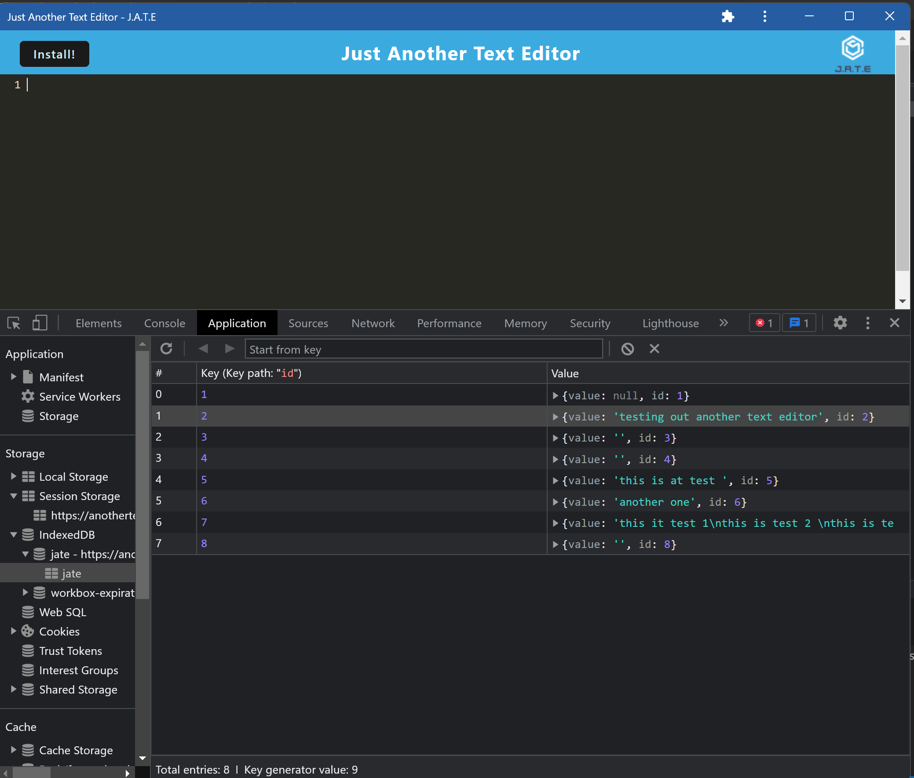

# Bootcamp-Challenge19-TextEditor
UTA coding bootcamp text editor

## Description

This is a text editor application that can store data in an indexedDb and be used offline. 

The following link is the deployed app on heroku:
https://anothertexteditor22.herokuapp.com/

The following image shows an example of installed app:

## Installation

N/A

## Usage

Upon loading the page, users are able to add text and once the app is installed, the same text will transfer over to the app. 
## Credits
UTA coding boot camp repo

## License

Please refer to the LICENSE in the repo.